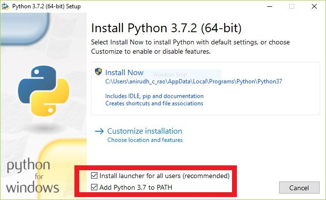

## Installation
* Install python 3.5 or later from [https://www.python.org/downloads/](https://www.python.org/downloads/).
  DO NOT INSTALL FROM THE WINDOWS STORE
    * Make sure to add python to path while installing it (check the box beside "Add python 3 to PATH" in the installation wizard)
    * click on Install Now  
    
    
    
* Now clone/download the repository to your desired location 
* Open command prompt 
* `cd` into the folder that you have downloaded and run the following command
    * `pip install -r requirements.txt`
* The supported browser for this script is only firefox, make sure you have firefox installed
* Open the main.py file with IDLE
* Change `number_shares_2019` value at line 167 to number of shares you bought in 2019 (bottom of the file)
* Change `number_shares_2020` value at line 168 to number of shares you bought in 2020 (bottom of the file)
* Change `company_name` value to the name of the company as depicted in [https://www.moneycontrol.com/stocks/histstock.php?classic=true](https://www.moneycontrol.com/stocks/histstock.php?classic=true)

## Running the script
* Open the command prompt
* `cd` into the folder that has the script
* Run the command `python main.py`
  
or 
  
* Right click the `main.py` file, select `open with` and choose `python`  
  
* Your output file will be generated in the same directory as the script
* DO NOT EDIT on the excel file. In case you wold like to make any calculations, copy the file elsewhere and do so, or make sure to restore the original file after editing it in te same directory
